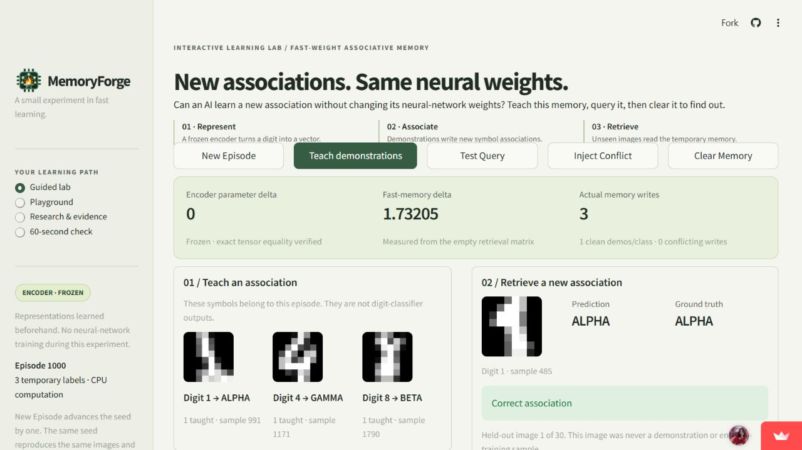
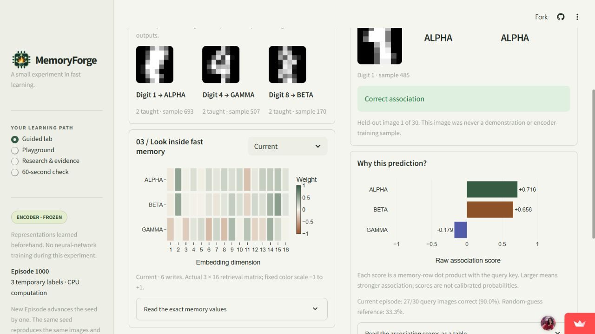
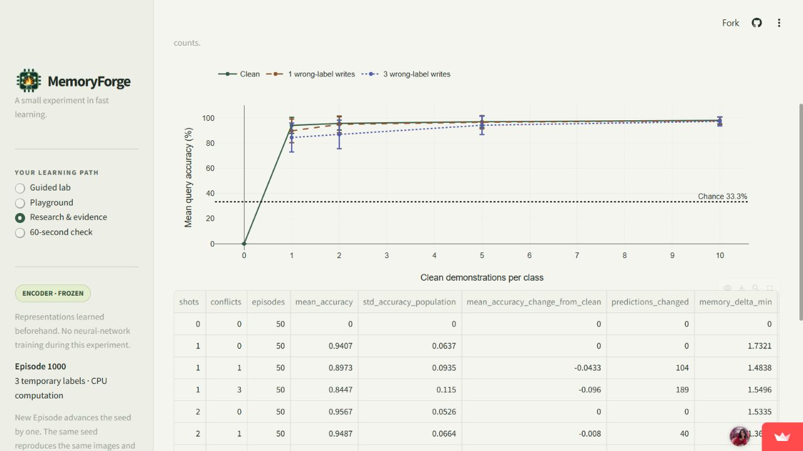

# MemoryForge

**Interactive Few-Shot Learning with Fast-Weight Associative Memory**

**DataForge 2026 · Team BitWise · Ved Patel and Deepshikha Rani**

[10-slide presentation](output/presentation/MemoryForge_DataForge2026_Presentation.pptx) ·
[Detailed data-flow diagrams](docs/DATA_FLOW.md) ·
[Presentation and screenshot notes](docs/PRESENTATION.md) · [Team roles](docs/TEAM.md)

> A neural system can rapidly learn new associations by updating temporary
> fast-weight memory while keeping its long-term model parameters unchanged.

MemoryForge makes this claim testable with real CPU computation. A small neural
encoder learns digit representations once. Demonstrations then teach temporary,
randomly assigned labels such as ALPHA, BETA and GAMMA using an associative
memory. New held-out images query that memory. Encoder tensors are checked for
exact equality before and after adaptation.

**Phase 4: READY WITH MANUAL ACTIONS.**
[Open MemoryForge](https://memoryforge.streamlit.app/) — public access and real
interactions verified without an owner login on 2026-09-08. The source, trained
checkpoint, evidence and both PDFs are included in the submission package.
Team review and the final portal upload remain; see the readiness report below.
MemoryForge is an educational fast-weight associative-memory model used to
demonstrate the concept. It does not implement or reproduce BDH or BDH-CQ.

[Repository](https://github.com/deeps2710/MemoryForge) ·
[Phase status](docs/PHASE_STATUS.md) · [Deployment instructions](docs/DEPLOYMENT.md) ·
[Requirement evidence](docs/REQUIREMENTS_MATRIX.md)

## The problem

“Learning” can mean changing trained parameters, accumulating context or updating
temporary memory. Those mechanisms are easy to conflate in a polished model demo.
MemoryForge exposes a small enough system to inspect every write and score, keep
the encoder audit visible, and deliberately test interference and forgetting.

## Audience and learning objectives

For early ML learners and data scientists familiar with basic neural networks,
vectors, classification and embeddings. The intended learning experience teaches
learners to distinguish frozen slow weights from writable temporary memory;
create and inspect an association; query an unseen image; test the effects of
more demonstrations, conflicting labels and reset; and explain why temporary
adaptation is useful but differs from permanent training. The sourced research
connection to BDH is integrated with primary sources; the guided lab, playground,
research lesson, evidence and learning checks are available now.

## Install and run

Use Python **3.12**; verified on Windows with Python 3.12.14 and CPU PyTorch.
Start in the repository root. A Python
installation must be available as `python` (or substitute its executable path).

```sh
python -m venv .venv
```

Activate with `.venv\Scripts\Activate.ps1` in PowerShell, or
`source .venv/bin/activate` on macOS/Linux. If PowerShell activation is restricted,
replace `python` below with `.\.venv\Scripts\python.exe`; activation is optional.

```sh
# The requirements select CPU PyTorch and constrain the tested dependency versions.
python -m pip install -r requirements.txt
python -m pip check

# Open the interactive lab with the checked-in checkpoint.
python -m streamlit run app.py
```

The default local address is [localhost:8501](http://localhost:8501). This is a
local preview, not the public submission URL. No training is needed to open it.
Stop the server with Ctrl+C in the terminal that launched it.

Core verification and explicit reproduction commands:

```sh
# The small checked-in checkpoint can be loaded immediately.
python scripts/smoke_test.py
python scripts/evaluate_core.py
python -m pytest -q

# Reproduce training explicitly; never triggered by evaluation or import.
python scripts/train_encoder.py

# Run the entire default benchmark twice and compare all recorded evidence.
python scripts/verify_replay.py
```

The requirements select the PyPI torch build on macOS; every tensor still runs
on CPU. macOS is unverified. The Windows checks do not establish Linux/cloud
behavior; public-deployment verification is recorded separately.

Dependency installation needs network access. Digits is bundled in scikit-learn;
training, evaluation and tests make no dataset/API network requests and require
no API keys. Missing weights produce an actionable error instructing you to run
the training script, with no automatic retraining.

Optional episode settings:

```sh
python scripts/evaluate_core.py --episodes 50 --n-way 3 --shots 5 --queries 10 --seed 1000
python scripts/evaluate_core.py --shots 1 --output artifacts/replay-one-shot.json
python scripts/train_encoder.py --seed 42 --split-seed 42 --output artifacts/encoder.pt
```

The split seed must match the checkpoint. For an encoder trained with another
split seed, also pass `--split-seed` to `evaluate_core.py`. Select 2–10 labels and
positive shot/query counts that fit the chosen classes' held-out pools; invalid
or impossible requests fail clearly.

## Use the lab

The guided page opens on seed 1000 with one real demonstration per class and a
held-out prediction. **Teach demonstrations** adds one new image per class;
**Test Query** advances through 30 held-out images. Watch the actual memory
matrix, association scores, prediction beside truth, and exact encoder audit.
**Inject Conflict** writes a taught image under the wrong symbol and reports its
measured effect. **Clear Memory** removes associations and makes the model
abstain. **New Episode** starts the next seed with fresh memory and a new preset.

In **Playground**, the 0–10 demonstrations/class slider rebuilds clean memory,
clearing conflicting writes. The mapping, demonstration order and 30 query
images stay fixed. Its chart contains only shot counts you have actually tried;
more demonstrations need not improve every episode. Arrow keys operate the slider.
The **60-second check** gives immediate explanations for three concept questions.
Switching learning pages preserves the experiment; a browser reload starts fresh.

The heatmap selector shows current or explicitly named historical snapshots.
Actions return it to Current. Expanders expose exact matrices, score tables,
real embedding keys and one-hot writes. Colors always have text labels.

Held-out embeddings are computed once per cached model; memory writes, retrieval,
charts and comparisons are computed live. Temporary memory belongs to each
browser session. The app never trains the encoder. Clean memory is capped at
10 demonstrations/class; repeated conflicts append additional writes.

## Mechanism

### Application screenshots

Actual captures of the public application on 8 September 2026. The first two
show seed 1000; the research page shows the separately saved evaluation suite.



The opening preset teaches one support per class. Its 30 fixed queries give
23 correct predictions; the displayed query has a prediction beside its truth.



After two demonstrations per class, six writes give 27/30 correct. The heatmap
and score plot show the computed retrieval matrix and its response to the query.



The research chart summarizes 50 fixed seeds. It is labelled saved evidence;
it does not represent only the current browser's live episode.

### Computation

1. Load 1,797 bundled 8×8 digits; divide pixels by 16. Stratify original row IDs
   into 1,347 training and 450 held-out images using split seed 42.
2. Train `64 → Linear(32) → ReLU → Linear(16)` plus a ten-digit classification
   head for 100 fixed epochs using training rows only. Freeze the encoder.
3. Select three digit classes and separately permute their arbitrary episode
   labels. Support and query images are distinct, drawn only from held-out rows.
4. Use normalized encoder embeddings as keys and one-hot episode labels as values.
5. Write support keys to temporary memory, query new keys, inject one wrong-label
   support association, and clear memory. Record real states and predictions.

The outer-product rule with explicit class-wise averaging is:

```text
S ← S + v kᵀ
c ← c + v
M[i] = S[i] / c[i] if c[i] > 0, else 0
scores = M q
```

Here `k` and `q` are unit embeddings, `v` is a one-hot episode label, `S` stores
sums, `c` counts writes, and `M` is the actual retrieval matrix. The ordinary digit
head is retained only for sanity evaluation; it never predicts episode labels.

`FastMemory` exposes `reset`, `write`, `write_batch`, `query`, `state_snapshot`,
`memory_delta` and `statistics`. Snapshots include raw sums, counts and the exact
retrieval matrix. Empty memory abstains (`prediction = -1`); the analytic `1/N`
chance baseline is the expected accuracy of uniform random guessing. Softmax
display scores are not calibrated probabilities. Unwritten labels cannot win;
exact ties among written labels use the first label index and are flagged.

## Measured Phase 1 evidence

Default checkpoint and seeds 1000–1049; 3-way, 5 shots/class, 10 queries/class:

| Measurement | Result |
|---|---:|
| Held-out ordinary digit sanity accuracy | 97.11% (437/450) |
| Mean episode accuracy | 97.53% |
| Episode population standard deviation | 3.11 percentage points |
| Chance reference | 33.33% |
| Evaluated queries | 1,500 across 50 episodes |
| Maximum encoder parameter delta | **0**, exact tensor equality |
| Minimum / mean clean memory delta | 1.51549 / 1.59116 |
| Accuracy after one wrong-label write per episode | 97.00% |
| Predictions changed by conflicts | 19/1,500 |

These are measured internal validation results, not competition thresholds.
Episodes may reuse held-out images and are not independent dataset draws.
The conflict can improve, worsen or leave a particular episode's accuracy
unchanged; the engine logs its actual effect.

`artifacts/encoder.pt` is locally trained, not an external pretrained model.
`encoder.training.json` records training seeds/configuration and sanity accuracy.
`evaluation.json` contains every mapping, sample ID, embedding, memory state,
query score, prediction and ground truth. `reproducibility.json` records two-run
exact comparison. `environment.json` and `verification.json` record the verified
environment and executed commands. All displayed predictions are computed.

## Measured Phase 2 evidence

The UI fixes a pool of 10 supports/class before selecting nested shot prefixes.
This preserves query images during a shot experiment and is **a different
sampling protocol from the Phase 1 benchmark**, even with seed 1000.

| Seed 1000 lab action | Writes | Accuracy on its 30 fixed queries |
|---|---:|---:|
| Initial one-shot preset | 3 | 76.7% |
| Teach to two shots/class | 6 | 90.0% |
| Append one wrong-label association | 7 | 86.7% |
| Clear memory | 0 | 0.0% (abstention) |
| Rebuild five clean shots/class | 15 | 73.3% |
| Rebuild ten clean shots/class | 30 | 96.7% |

Encoder parameter delta is exactly **0** throughout. The conflict changes five
of 30 predictions. The non-monotonic shot results are retained, not smoothed into
an expected curve. The default five-shot Phase 1 result is not the UI preset.

On the recorded Windows CPU environment, 30 samples/action gave core-action
medians of 1.41–4.64 ms and a maximum of 6.85 ms. Ten samples/action gave
Streamlit AppTest rerun medians of 53.73–72.82 ms and a maximum of 135.41 ms.
Three observed browser teach/query/conflict clicks took 443/335/338 ms to visible
feedback, including automation overhead. AppTest excludes browser paint and
network transport; these local observations are not a universal latency promise.

All **105 tests passed** (77 existing + 28 Phase 2). See the
[walkthrough](docs/PHASE_2_WALKTHROUGH.md), [report](docs/PHASE_2_REPORT.md), and
`artifacts/phase2_{demo,latency,verification,environment}.json` for evidence.

```sh
python scripts/record_lab.py
python scripts/benchmark_lab.py
```

## Research and Phase 3 evidence

**Research & evidence** connects your current episode to BDH and BDH-CQ, contrasts
DeltaNet and Titans, derives an actual write and query, and presents a saved
paired evidence suite. Four qualifying primary sources are linked beside claims:
[BDH](https://arxiv.org/html/2509.26507v1),
[DeltaNet](https://arxiv.org/html/2406.06484v3),
[Titans](https://arxiv.org/html/2501.00663v1), and
[BDH-CQ](https://arxiv.org/html/2608.09888v1).
The [claim ledger](docs/research_sources.json) records versions, dates and limits.
MemoryForge does not implement these architectures or claim their benchmarks.

Across 50 fixed seeds, clean mean accuracies at 1/2/5/10 shots are
94.07%/95.67%/96.93%/98.07%. With three appended wrong-label writes they are
84.47%/86.87%/94.20%/97.27%. Encoder delta is exactly zero in all 650 condition
evaluations. The 19,500 query outcomes share samples; population deviations in
the chart are descriptive, not confidence intervals from independent datasets.
The report reproduces exactly and is stored in `artifacts/phase3_evidence.json`.

```sh
python scripts/evaluate_suite.py
python scripts/verify_robustness.py --output artifacts/phase4_robustness.json
```

The robustness command uses a fresh workspace-local pytest scratch directory,
checks dependencies, runs all tests and smoke, regenerates the encoder separately
and compares its tensors/evaluation against the saved baseline. A fresh isolated
Windows Python 3.12.14 installation passed **124 tests**; no-connection tests
exercise the app with fresh caches. Dependencies require installation Internet;
external citations require connectivity when opened. No global network settings
are changed. Old pytest folders on this development machine were inaccessible;
the workspace-local strategy avoids depending on their permissions.

See the [technical walkthrough](docs/TECHNICAL_WALKTHROUGH.md) and
[Phase 3 report](docs/PHASE_3_REPORT.md).

## Project layout

The separately requested [project blog PDF](output/pdf/MemoryForge_Blog.pdf) and
[one-page concept summary PDF](output/pdf/MemoryForge_OnePage_Summary.pdf) are
available with [editable sources and build instructions](docs/PDF_DELIVERY.md).
Both were redesigned on 8 September 2026 with MemoryForge as the main title.
The blog has six pages and the summary exactly one. A
[presentation PDF](output/pdf/MemoryForge_DataForge2026_Presentation.pdf) provides
a viewing copy of the ten-slide deck. The old concept-summary filename remains
a byte-identical alias for existing application links. The organizer
and portal have now been inspected: the portal requires one ZIP and a Pathway
Track selection. See the [submission audit](docs/SUBMISSION_INSTRUCTIONS_AUDIT.md).
The separate blog is a submission-format draft because no separate blog format
was defined. The one-page concept summary is a distinct, required briefing.

```text
app.py        Streamlit entry point; run with python -m streamlit run app.py
src/          ML engine, isolated lab sessions, UI, charts and quiz
assets/       original CSS and the user-supplied application logo
.streamlit/   theme and runtime configuration; no secrets required
scripts/      explicit training, evaluation, replay and lab evidence commands
tests/        math, isolation, replay and Streamlit integration checks
artifacts/    small checkpoint and actual reproducible evidence
docs/         architecture, decisions, phase gate, requirements and disclosures
output/pdf/   blog and one-page concept summary
output/presentation/  ten-slide DataForge deck with editable architecture and measured chart
```

The pre-existing unrelated `html` file is preserved and is not an application
entry point. See [architecture](docs/ARCHITECTURE.md) for equations and data flow,
and [decisions](docs/PROJECT_DECISIONS.md) for reasons and alternatives.

## Scope, sources and ownership

The encoder has already learned these digit identities. Fast adaptation learns
temporary label assignments, not visual categories from scratch. The small data
and simple class-mean memory do not establish claims about large models, memory
capacity or continual learning. See [limitations](docs/LIMITATIONS.md).

Data: Alpaydin and Kaynak's *Optical Recognition of Handwritten Digits* via the
scikit-learn bundled subset. Its original UCI page lists CC BY 4.0; attribution,
modifications and license evidence are in [provenance](docs/PROVENANCE.md).
Original project code, documentation, diagrams and generated weights are covered
by the owner-selected [MIT license](LICENSE). The logo, initial html, dataset,
dependencies, research and embedded fonts have separate rights/notices.

Codex assisted implementation, tests, evaluation and documentation; see
[AI assistance](docs/AI_ASSISTANCE.md). Team review and technical ownership remain
required. Four recent primary research papers/reports and official BDH code were
verified in Phase 3; [research notes](docs/RESEARCH_NOTES.md) link the claim ledger.

Credits: MemoryForge contributors supplied project direction and requirements,
selected the logo and approved the license. Codex assisted code, experiments,
writing and browser verification. Dataset credit belongs to Alpaydin and Kaynak;
the app uses PyTorch, scikit-learn, NumPy/SciPy, Streamlit, Plotly and pandas.
Full [installed notices](docs/DEPENDENCY_NOTICES.txt),
[Streamlit/frontend/font notices](docs/STREAMLIT_NOTICES.txt) and
[PDF font notices](docs/PDF_FONT_NOTICES.txt) accompany the provenance record.
The user supplied the ChatGPT-named logo; no independent creation-history or
general reuse-license claim is made.

## Deployment and submission package

Deploy the real Streamlit app from `deeps2710/MemoryForge`, branch `main`,
entrypoint `app.py`, with Python **3.12** and no secrets. Explicitly select 3.12
in Advanced settings; the provider default 3.14 cannot install the pinned
PyTorch 2.6 CPU wheel. For this existing app, Settings → General allowed the
runtime change. [Deployment evidence](docs/DEPLOYMENT.md) records the fix,
public checks and startup limits. PyArrow is pinned to 24.0.0 to match the
provider compatibility override.

The final dependency configuration passed all **124 tests in 15.76s**, pip check,
five smoke checks, exact checkpoint regeneration and numerical core replay.
Public seed 1000 reproduced 23/30 → 27/30 → 26/30 across preset, teaching and
conflict; reset cleared memory and the encoder delta stayed zero. Four observed
cloud actions took 952–1,017 ms including automation overhead; these are single
observations, not latency guarantees. See artifacts/phase4_final_robustness.json
and artifacts/phase4_deployment.json.

Rehearse the [one-minute demo](docs/DEMO_SCRIPT.md), review the
[rubric audit](docs/RUBRIC_AUDIT.md) and [readiness report](docs/SUBMISSION_READINESS_REPORT.md).
Build the portal ZIP from the latest reviewed Git checkout (Git is required
for the revision manifest; running the extracted app does not require Git):

```sh
python scripts/build_submission.py
```

It writes `output/submission/MemoryForge_Submission_DRAFT.zip`, verifies every
entry against its source bytes and includes a revision/hash manifest. Local
environments, caches, secrets, unrelated html and the archive itself are excluded.
The ZIP is deliberately not committed to avoid recursively packaging releases;
its builder, source, both PDFs, presentation and detailed DFD document are public.
Packaging is not competition submission.

The portal's observed submission deadline is 8 September 2026, 11:59 PM IST;
verify it again on the [live event page](https://unstop.com/hackathons/dataforge-2026-iit-kharagpur-1739346).
This differs from the registration deadline. See the
[gated future roadmap](docs/FUTURE_ROADMAP.md) and
[original development brief](docs/DEVELOPMENT_BRIEF.md).

Post-hackathon extensions require a separate user instruction. Phase 4 ends with
the readiness report; automated tests do not certify human technical ownership.
