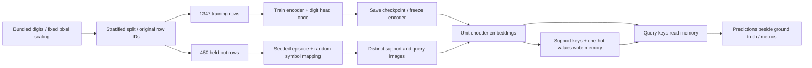

# Architecture — Phase 1

MemoryForge's ML logic lives in `src/`; scripts are explicit command-line entry
points. No module trains or loads a dataset merely by being imported.



## Data and slow training

`data.py` retains all original row IDs, scales pixels by the fixed constant 16
(no fitted normalization), and creates a stratified 75/25 split. It reports a
SHA-256 fingerprint of normalized features and targets. Support and query
sampling is without replacement within a class and episode, exclusively from
the held-out IDs. Different episodes may reuse rows.

`training.py` fits a 64→32→16 encoder with ReLU after the first linear layer and
a 16→10 classification head. Adam uses learning rate 0.003, weight decay 0.0001,
batch size 64 and 100 fixed epochs. Only training rows contribute gradients.
The held-out digit accuracy is measured after training; it does not select the
checkpoint or stop training. Encoder parameters are frozen and gradients cleared.

The small checkpoint contains encoder weights, the separate sanity-check head,
architecture, row partitions, data fingerprint, all seeds and training report.
`load_encoder` maps it to CPU with `weights_only=True` and restores a frozen
encoder. Evaluation verifies checkpoint/data agreement before sampling episodes.
The head is never called for episodic label prediction.

## Fast memory equations

Normalize each encoder output and query: k = z / ||z||₂, q = z_query / ||z_query||₂.
Reject zero or nonfinite keys. For one-hot episode label v:

```text
S ← S + v kᵀ          # raw Hebbian sum, labels × embedding dimension
c ← c + v             # writes per label
M[i] = S[i] / c[i]    # when c[i] > 0, otherwise a zero row
scores = M q          # queries stored in rows use Q @ M.T
```

This is class-wise averaging of the brief's outer-product rule. The norm of
each mean may be below one; we do not renormalize class means. The exact matrix
used for scoring is available as `state_snapshot().matrix`, with the raw sums
and counts alongside it. A delta is the Frobenius norm of the effective matrix
difference. Repeating an identical key may change sums/counts without changing
the effective matrix; state hashes include all three.

Unwritten labels are masked for prediction and score normalization. Empty memory
abstains (`-1`), with raw scores zero and uniform display scores; this is not a
random prediction. Exact ties among written labels choose the first label index
and are flagged. Softmax scores are display values, never calibrated confidence.

Memory inputs are detached CPU float64 tensors; the encoder uses float32. Batch
writes validate all keys and one-hot values before the first update. Snapshots
are copies. No optimizer, head, loss or backward call exists on the memory path.

## Evaluation and reproducibility

Default evaluation: seeds 1000–1049, 3-way, 5 supports and 10 queries per class.
Each episode selects three digit identities and separately permutes symbolic
labels. The chance reference is analytic 1/3. Mean and population standard
deviation describe the 50 measured episode accuracies.

For each episode the engine records empty state, clean state, a single appended
wrong-label association using the first support key, then reset. Ground truth
does not change after the conflict. It retains support/query IDs, embeddings,
actual matrices/scores/predictions, and measured parameter and memory deltas.
Encoder tensors are compared with `torch.equal`, not only `requires_grad` flags.

`seed_everything` sets Python, NumPy, PyTorch and deterministic CPU algorithms
with one Torch thread. The split and each episode have explicit independent seed
records. Timestamps and runtime durations are excluded from deterministic results.
`verify_replay.py` compares two complete evaluation reports, including states.

## Module responsibilities

| Module | Responsibility |
|---|---|
| `config.py`, `reproducibility.py` | Validated configs, seed control, environment and hashes |
| `data.py` | Bundled inputs, normalization, partition IDs and metadata |
| `encoder.py`, `training.py` | Supervised pretraining, persistence, embeddings and exact weight audit |
| `episodes.py` | Arbitrary symbolic label bijections and disjoint sample selection |
| `fast_memory.py` | Write, query, snapshots, statistics and reset |
| `evaluation.py` | Clean/conflict/reset experiments and actual aggregate evidence |

Phase 2 will call these modules from Streamlit; it has not been implemented.
