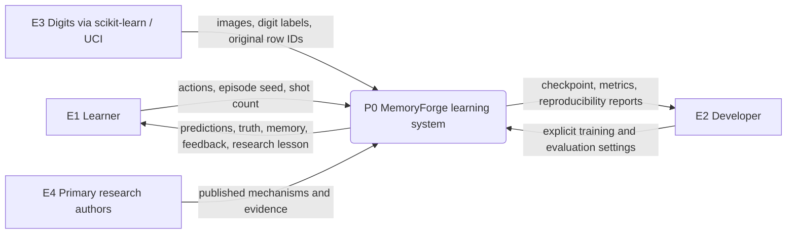
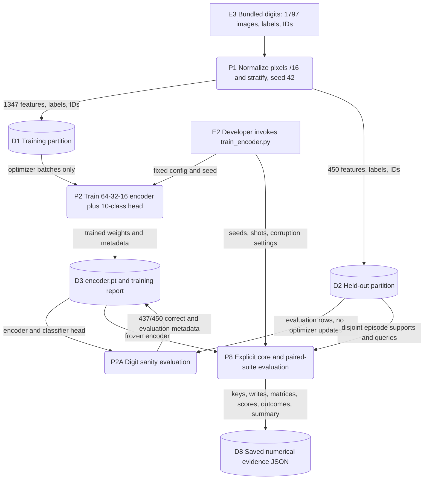
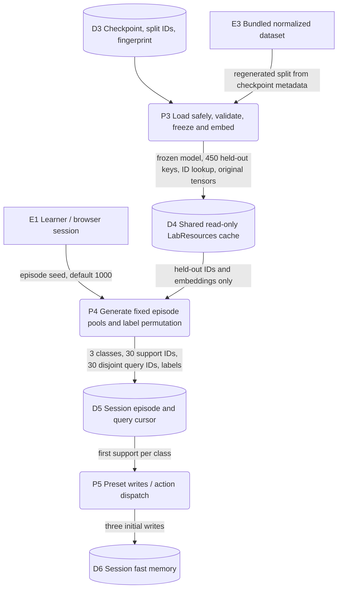
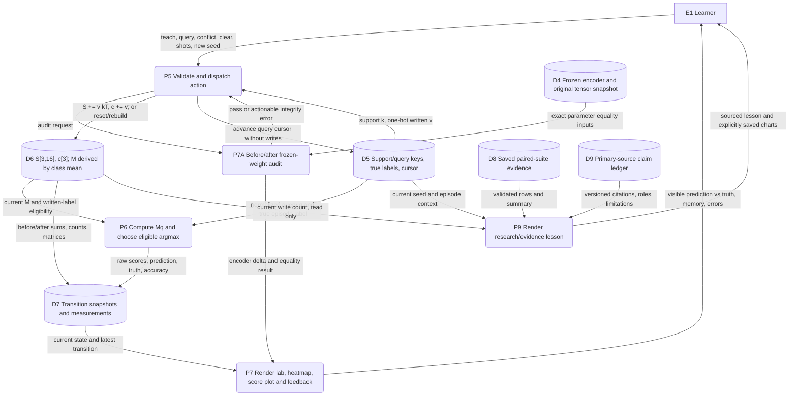

# MemoryForge data-flow diagrams

DataForge 2026, Pathway track. **Team BitWise: Deepshikha Rani and Ved Patel.**
The PowerPoint includes two editable DFD views. The diagrams below provide the
full flow and a data dictionary for technical review. They describe the current
implementation, not a proposed future architecture.

Notation: E identifies an external entity, P a process, and D a data store.
Arrows name data or user commands. Persistent files differ from the shared
read-only resource cache and each browser's volatile session state. There is no
application database, user-upload pipeline, external model API or background
training service in this release.

## Level 0: system context

The system boundary includes explicit offline developer tools and the deployed
app. The dataset ships inside scikit-learn. The app does not contact UCI during
normal operation. Research content comes from a checked-in claim ledger.
Following a citation opens the external paper; the app itself does not query a
language model or fetch a paper to produce its explanations.

## Level 1A: explicit offline training and evidence generation

P2 runs 100 epochs of Adam on CPU with the checked-in fixed configuration.
Training scripts require an explicit developer command. The deployed entrypoint
only loads the checkpoint. The 10-class classifier head supports digit training
and sanity evaluation; episode retrieval predicts temporary symbols from Mq.
P2A is a logical sub-process within the training/evaluation tooling, not a
separate deployed service. A diagrammed process need not imply a separate file.

Sources: [data loading](../src/data.py), [training](../src/training.py),
[training command](../scripts/train_encoder.py),
[core evaluation](../scripts/evaluate_core.py),
[paired suite](../scripts/evaluate_suite.py).

## Level 1B: runtime initialization and per-browser episode

The cache key includes the checkpoint path, size and modification time. The
loader validates the dataset fingerprint and original split IDs, rejects bad
checkpoint structure and keeps inference on CPU. Only held-out row IDs have
entries in the embedding lookup. Each session receives a new LabSession.
Memory is never shared through `st.cache_resource`.

Within each seed, P4 chooses three classes, independently permutes their symbol
labels and allocates ten supports plus ten queries per class. These pools stay
fixed while the learner varies shots. The preset uses one support per class.
The UI sampler uses a fixed ten-support pool; Phase 1's configurable evaluator
has its own sampling protocol. Their numerical results must not be conflated.

Sources: [entrypoint and cache](../app.py), [LabResources and LabSession](../src/lab.py),
[checkpoint validation](../src/encoder.py), [episode generator](../src/episodes.py).

## Level 2: session adaptation, retrieval and rendering

P5 action semantics:

| Action | Data movement and state change |
|---|---|
| Teach demonstrations | Append the next unused support key for each class with its true episode symbol. Increment clean shots. |
| Test Query | Advance the session cursor through the 30 held-out queries. Read Mq without modifying S or c. |
| Inject Conflict | Append the first taught support key under the next cyclic label. Preserve the original truth. Increment conflict count. |
| Clear Memory | Zero S and c, set clean/conflict counts to zero and record an after-reset snapshot. The model abstains. |
| Set shot count | Rebuild clean memory from nested support prefixes. Clear prior conflicts while preserving the episode mapping/query set. |
| New Episode | Create a new LabSession using the next seed and its initial preset. |
| Open Research | Inspect episode context without writing memory. Load the checked-in evidence and claim ledger for explanation. |

`_begin` and `_finish` bracket memory-changing operations with audits and
before/after query sets. Query and rendering paths also audit frozen weights.
Any integrity failure stops the normal result and produces an actionable error.
Empty memory returns prediction -1. Unwritten rows cannot win, even when all
written scores are negative. Exact eligible ties select the first label index
and carry a tie flag. Row means are not renormalized after averaging.

Sources: [UI dispatch](../src/ui.py), [session state and audit](../src/lab.py),
[memory mathematics](../src/fast_memory.py), [research rendering](../src/research.py).

## Data dictionary and persistence

| Store | Contents and size | Lifetime / write authority |
|---|---|---|
| D1 | 1,347 normalized 64-feature images, digit labels and original IDs | Recreated deterministically by offline dataset loading. Only training consumes optimizer batches. |
| D2 | 450 normalized held-out images, labels and original IDs | Recreated from split metadata. Evaluation and episode sampling only. |
| D3 | `artifacts/encoder.pt`, original split IDs, fingerprint, training metadata | Persistent repository artifact. Only explicit training writes it. App reads it. |
| D4 | Frozen encoder, 450 × 16 keys, held-out ID lookup and original parameter tensors | Shared cache per server/checkpoint signature. Application treats it as read only. |
| D5 | Three selected classes, symbol permutation, 30 support and 30 query IDs/keys/labels, cursor | Per-browser LabSession. Supports and queries are disjoint within an episode. |
| D6 | Float64 S of shape 3 × 16 and c of shape 3; derived retrieval matrix M | Per-session volatile memory. S+c contain 51 float64 values, 408 raw bytes, excluding derived tensors, snapshots and Python overhead. |
| D7 | Before/after memory snapshots, actual write records, scores, accuracy and timing | Per-session transition/history. This adds memory beyond the 408-byte core state. |
| D8 | `artifacts/phase3_evidence.json`: 650 conditions, 19,500 query outcomes | Persistent developer-generated evidence. Research page reads it and labels it saved computation. |
| D9 | `docs/research_sources.json`: primary versions, claims, locators, relevance and limits | Persistent curated source ledger. Links open external publications on request. |

There is no read path from query truth into a memory write. Query truth is used
only to score predictions. Training and held-out IDs remain separate. A reload
creates a fresh browser lab; switching learning pages preserves the session.
All evidence in this document concerns the implemented digit/symbol toy.
MemoryForge implements neither the full BDH architecture nor CQ latent reasoning.
