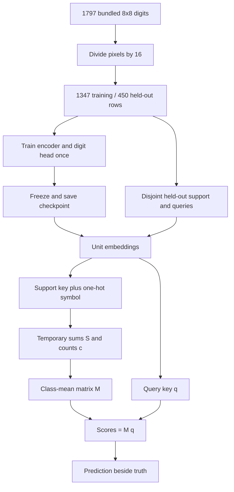

# Technical walkthrough for the MemoryForge team

This guide supports review and live defense; it does not claim a human review
has occurred. The testable claim is that temporary associations can change
while every long-term encoder tensor remains identical.

## Data flow and training



Pixels become 64 float32 features scaled by a fixed 16; no fitted scaler leaks
held-out statistics. Stratified split seed 42 retains original row IDs. The
encoder is Linear(64,32), ReLU, Linear(32,16), with a separate Linear(16,10)
training head. Training uses 100 fixed epochs, Adam, learning rate 0.003, weight
decay 0.0001 and batches of 64. Only training rows contribute loss. The digit
head never predicts arbitrary episode symbols.

The checkpoint stores configuration, seeds, partition IDs, fingerprint and
weights. Loading uses CPU and weights_only=True, validates the data/split and
freezes the encoder. The audit measures parameter delta and compares copied
tensors using torch.equal. requires_grad=False alone is not proof of immutability.

## Episode mapping and separation

Three selected digit identities receive an independent random permutation of
ALPHA/BETA/GAMMA. The ordinary digit head cannot directly supply that mapping.
The encoder has already learned digit identities: adaptation binds symbols,
rather than learning new visual concepts from scratch.

The UI fixes 10 candidate supports/class and 10 queries/class per seed. Shots
0–10 select nested support prefixes; mapping and query rows remain identical.
Supports and queries are distinct held-out rows, with no encoder-training overlap.
Different seeds can reuse rows. Phase 1's five-shot sampler is a different
protocol, so its reported number is not the accuracy of a particular UI preset.

## Derive the implementation

Keys k and query q are unit vectors of length 16. Value v is a length-3 one-hot
label. S and M have shape 3×16; c has length 3.

```text
S <- S + v k^T
c <- c + v
M[i] = S[i] / c[i] when c[i] > 0, otherwise zero
scores = M q

score_i = sum_d M[i,d] q[d]
        = (1 / c[i]) sum_(writes j assigned to i) dot(k_j, q)
```

A one-hot v adds k to just one sum row. Averaging by that label's write count
keeps scaling fair across shot counts. Class means are not normalized again.
Memory normalizes incoming keys/queries in float64 after encoder normalization
in float32. The equation inspector matches that normalization and independently
sums each dimension's contribution without applying the inspected write.

The headline memory delta is a Frobenius norm against empty memory; a transition
delta compares before/after one action. More diverse keys may shorten the mean.
An identical repeated key can change sums/counts without changing the mean,
which is why snapshots expose all three arrays.

Unwritten labels cannot win; empty memory abstains with prediction -1 and zero
accuracy. The 1/3 chance line refers to uniform random guessing, not abstention.
Scores are similarities, not calibrated probabilities. Exact ties choose the
first eligible label and are flagged. No optimizer runs during adaptation.

## Actions and session lifetime

New Episode advances the seed and creates a fresh one-shot preset. Teach appends
one new support/class. Test Query advances through 30 queries without writing.
Conflict appends support zero under the next cyclic label while truth stays
unchanged. Repeated conflicts repeat that association. Clear zeros sums/counts.
The shot slider rebuilds clean memory and removes conflicts.

Only frozen resources and held-out embeddings are globally cached. Each browser
session owns its temporary memory and history. Learning-page navigation preserves
the session; reload discards it. Historical snapshots are labelled, and actions
return the heatmap to Current.

## Evidence and charts

Run `python scripts/evaluate_suite.py`. The default suite uses seeds 1000–1049,
shots 0,1,2,5,10 and 0,1,3 appended wrong-label writes. Zero shots has only a clean
abstention condition. The result contains 650 condition evaluations and 19,500
query outcomes. Each group contains 50 episode accuracies.

The mean and population standard deviation (ddof=0) describe these fixed seeds.
Error bars are not confidence intervals. Conditions share query images, and
episodes may reuse held-out rows. Corruption is an absolute count, so three extra
writes represent different contamination fractions at different shot counts.

Each corrupted row is paired with the same seed/shot count's clean result.
Raw evidence contains IDs, mappings, keys, write positions, sums/counts/matrices,
scores, predictions, ties, measured memory/parameter deltas and reset checks.
Independent NumPy tests reconstruct the memory and scores. The script compares
two complete reports exactly; timing is kept outside deterministic evidence.

The app recomputes summary values from raw observations and rejects disagreement.
It checks the saved encoder digest against the live model. Plotly uses the
recorded means/deviations and exposes a numeric table. Saved suite results are
labelled as saved computation; interactive writes and queries are computed live.

## Research and ownership

The research lesson starts from the learner's actual state, connects to BDH and
BDH-CQ, distinguishes other memory-update designs, and presents the derivation
and evidence. Nearby citations and limitations come from
[research_sources.json](research_sources.json). [Research notes](RESEARCH_NOTES.md)
record the verification process. MemoryForge does not implement BDH or BDH-CQ.

## Likely judge questions

| Question | Defensible answer |
|---|---|
| What learned the new mapping? | Temporary memory; exact encoder tensors stayed unchanged. Representations were trained beforehand. |
| Is this class-mean classification? | Yes, over arbitrary episode symbols. Its simplicity makes writable state inspectable. |
| Where might leakage occur? | Training, support and query rows must remain separated. Original-row-ID tests verify this; queries never write. |
| Why use random labels? | To prevent the ordinary digit classifier from supplying episode labels directly. |
| Why can the memory norm fall? | M averages unit keys; different directions can produce a shorter mean. |
| Can a conflict improve accuracy? | Yes on some episodes. We retain the actual paired change instead of forcing a failure. |
| Is ten shots always better? | No per-seed guarantee; report the mean and variability and preserve non-monotonic examples. |
| Are scores probabilities? | No; raw similarities or their display softmax are not calibrated. |
| Does the BDH connection prove LLM reasoning? | No; a conceptual connection does not reproduce the architecture or task. |
| What is precomputed? | Held-out embeddings are cached; the multi-seed report is saved. Writes, queries and current matrices are live. |
| Is installation offline? | No. Offline runtime tests apply after dependencies and the bundled dataset are available. |
| What remains? | Phase 4 deployment, licenses, portal clarification and final audit. The user separately requested and received both PDFs before that phase. |

## Limits to state aloud

Tiny digits, familiar visual identities, supervised representations, fixed memory
size, targeted corruption, overlapping episodes and Windows-only execution bound
the conclusions. This toy has no language benchmark, consolidation, capacity
proof, gradient-based test-time learner or iterative latent workspace. Full
provenance and submission audits remain gated.
